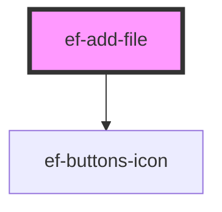

# ef-add-file

<!-- Auto Generated Below -->

## Properties

| Property     | Attribute     | Description | Type     | Default           |
| ------------ | ------------- | ----------- | -------- | ----------------- |
| `buttonText` | `button-text` |             | `string` | `'Add Files'`     |
| `files`      | --            |             | `File[]` | `[]`              |
| `title`      | `title`       |             | `string` | `'add file here'` |

## Events

| Event          | Description | Type                  |
| -------------- | ----------- | --------------------- |
| `change-value` |             | `CustomEvent<File[]>` |

## Dependencies

### Depends on

- [ef-buttons-icon](../ef-buttons-icon)

### Graph

----------------------------------------------

*Built with [StencilJS](https://stenciljs.com/)*
