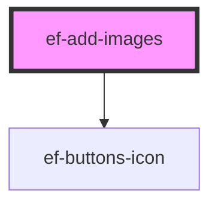

# ef-add-images

<!-- Auto Generated Below -->

## Properties

| Property     | Attribute     | Description | Type       | Default                            |
| ------------ | ------------- | ----------- | ---------- | ---------------------------------- |
| `addImage`   | `add-image`   |             | `boolean`  | `false`                            |
| `circle`     | `circle`      |             | `boolean`  | `false`                            |
| `error`      | `error`       |             | `string`   | `undefined`                        |
| `height`     | `height`      |             | `number`   | `100`                              |
| `infoIcon`   | `info-icon`   |             | `string`   | `'add'`                            |
| `itemActive` | `item-active` |             | `number`   | `1`                                |
| `multiple`   | `multiple`    |             | `boolean`  | `false`                            |
| `photosUrl`  | --            |             | `string[]` | `[]`                               |
| `subTitle`   | `sub-title`   |             | `string`   | `''`                               |
| `title`      | `title`       |             | `string`   | `''`                               |
| `urlIcon`    | `url-icon`    |             | `string`   | `EVERYFRAMEWORKICONS['ADD_IMAGE']` |
| `width`      | `width`       |             | `number`   | `100`                              |

## Events

| Event          | Description | Type                  |
| -------------- | ----------- | --------------------- |
| `change-value` |             | `CustomEvent<File[]>` |

## Dependencies

### Depends on

- [ef-buttons-icon](../ef-buttons-icon)

### Graph

----------------------------------------------

*Built with [StencilJS](https://stenciljs.com/)*
