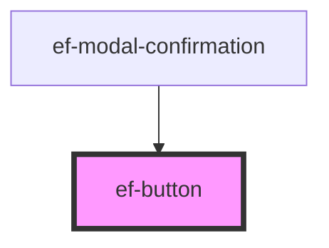

# ef-button

<!-- Auto Generated Below -->

## Properties

| Property   | Attribute  | Description | Type                             | Default     |
| ---------- | ---------- | ----------- | -------------------------------- | ----------- |
| `color`    | `color`    |             | `"PRIMARY" \| "SECONDARY"`       | `'PRIMARY'` |
| `disabled` | `disabled` |             | `boolean`                        | `false`     |
| `size`     | `size`     |             | `"LARGE" \| "MEDIUM" \| "SMALL"` | `'LARGE'`   |
| `text`     | `text`     |             | `string`                         | `undefined` |
| `urlIcon`  | `url-icon` |             | `string`                         | `undefined` |

## Events

| Event   | Description | Type               |
| ------- | ----------- | ------------------ |
| `event` |             | `CustomEvent<any>` |

## Dependencies

### Used by

 - [ef-modal-confirmation](../ef-modal-confirmation)

### Graph

----------------------------------------------

*Built with [StencilJS](https://stenciljs.com/)*
