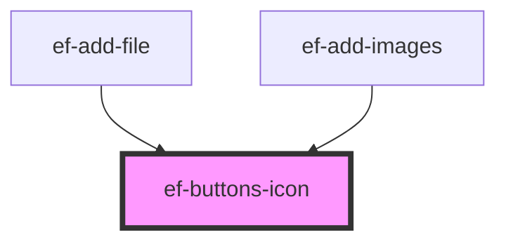

# ef-buttons-icon

<!-- Auto Generated Below -->

## Properties

| Property  | Attribute | Description | Type                                 | Default        |
| --------- | --------- | ----------- | ------------------------------------ | -------------- |
| `align`   | `align`   |             | `"HORIZONTAL" \| "VERTICAL"`         | `'HORIZONTAL'` |
| `buttons` | --        |             | `{ urlIcon: string; id: string; }[]` | `undefined`    |

## Events

| Event   | Description | Type                  |
| ------- | ----------- | --------------------- |
| `event` |             | `CustomEvent<string>` |

## Dependencies

### Used by

 - [ef-add-file](../ef-add-file)
 - [ef-add-images](../ef-add-images)

### Graph

----------------------------------------------

*Built with [StencilJS](https://stenciljs.com/)*
