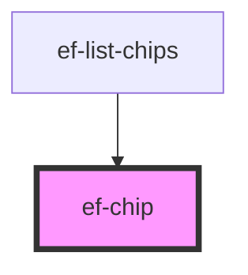

# ef-chip

<!-- Auto Generated Below -->

## Properties

| Property | Attribute | Description | Type               | Default     |
| -------- | --------- | ----------- | ------------------ | ----------- |
| `cancel` | `cancel`  |             | `boolean`          | `undefined` |
| `text`   | `text`    |             | `string`           | `undefined` |
| `value`  | `value`   |             | `number \| string` | `undefined` |

## Events

| Event   | Description | Type                            |
| ------- | ----------- | ------------------------------- |
| `event` |             | `CustomEvent<number \| string>` |

## Dependencies

### Used by

 - [ef-list-chips](../ef-list-chips)

### Graph

----------------------------------------------

*Built with [StencilJS](https://stenciljs.com/)*
