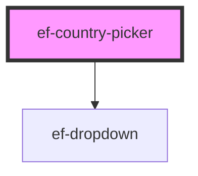

# ef-country-picker

<!-- Auto Generated Below -->

## Properties

| Property       | Attribute        | Description | Type      | Default                             |
| -------------- | ---------------- | ----------- | --------- | ----------------------------------- |
| `disabled`     | `disabled`       |             | `boolean` | `false`                             |
| `errorMessage` | `error-message`  |             | `string`  | `undefined`                         |
| `label`        | `label`          |             | `string`  | `undefined`                         |
| `urlIconLeft`  | `url-icon-left`  |             | `string`  | `undefined`                         |
| `urlIconRight` | `url-icon-right` |             | `string`  | `EVERYFRAMEWORKICONS['ARROW_DOWN']` |
| `value`        | `value`          |             | `string`  | `undefined`                         |

## Dependencies

### Depends on

- [ef-dropdown](../ef-dropdown)

### Graph

----------------------------------------------

*Built with [StencilJS](https://stenciljs.com/)*
