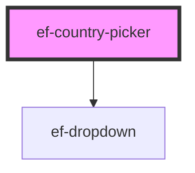

# ef-country-picker

<!-- Auto Generated Below -->

## Properties

| Property       | Attribute       | Description | Type      | Default     |
| -------------- | --------------- | ----------- | --------- | ----------- |
| `CountryCode`  | `country-code`  |             | `boolean` | `true`      |
| `countryName`  | `country-name`  |             | `boolean` | `true`      |
| `disabled`     | `disabled`      |             | `boolean` | `false`     |
| `errorMessage` | `error-message` |             | `string`  | `undefined` |
| `flag`         | `flag`          |             | `boolean` | `true`      |
| `label`        | `label`         |             | `string`  | `undefined` |
| `value`        | `value`         |             | `string`  | `undefined` |

## Events

| Event          | Description | Type                  |
| -------------- | ----------- | --------------------- |
| `change-value` |             | `CustomEvent<object>` |

## Dependencies

### Depends on

- [ef-dropdown](../ef-dropdown)

### Graph

----------------------------------------------

*Built with [StencilJS](https://stenciljs.com/)*
