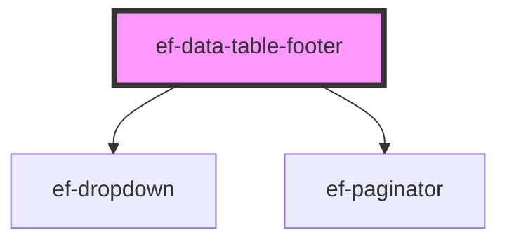

# ef-data-table-footer

<!-- Auto Generated Below -->

## Properties

| Property             | Attribute              | Description | Type                                        | Default                                                                                                                                        |
| -------------------- | ---------------------- | ----------- | ------------------------------------------- | ---------------------------------------------------------------------------------------------------------------------------------------------- |
| `dataType`           | `data-type`            |             | `string`                                    | `'Usuarios'`                                                                                                                                   |
| `disabledFilter`     | `disabled-filter`      |             | `boolean`                                   | `false`                                                                                                                                        |
| `errorMessageFilter` | `error-message-filter` |             | `string`                                    | `undefined`                                                                                                                                    |
| `itemsCount`         | `items-count`          |             | `string`                                    | `'200'`                                                                                                                                        |
| `itemsFilter`        | --                     |             | `{ id: string \| number; text: string; }[]` | `[     { id: 0, text: '10' },     { id: 1, text: '20' },     { id: 2, text: '30' },     { id: 4, text: '40' },     { id: 5, text: '50' },   ]` |
| `labelFilter`        | `label-filter`         |             | `string`                                    | `undefined`                                                                                                                                    |
| `leftText`           | `left-text`            |             | `string`                                    | `'Mostrando:'`                                                                                                                                 |
| `pageActive`         | `page-active`          |             | `number`                                    | `1`                                                                                                                                            |
| `pages`              | `pages`                |             | `number`                                    | `4`                                                                                                                                            |
| `rightText`          | `right-text`           |             | `string`                                    | `'Total'`                                                                                                                                      |
| `valueFilter`        | `value-filter`         |             | `number`                                    | `10`                                                                                                                                           |
| `visiblePages`       | `visible-pages`        |             | `number`                                    | `3`                                                                                                                                            |

## Events

| Event                      | Description | Type                  |
| -------------------------- | ----------- | --------------------- |
| `change-value-filter`      |             | `CustomEvent<object>` |
| `change-value-page-active` |             | `CustomEvent<number>` |

## Dependencies

### Depends on

- [ef-dropdown](../ef-dropdown)
- [ef-paginator](../ef-paginator)

### Graph

----------------------------------------------

*Built with [StencilJS](https://stenciljs.com/)*
