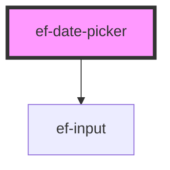

# ef-date-picker

<!-- Auto Generated Below -->

## Properties

| Property      | Attribute      | Description | Type      | Default                 |
| ------------- | -------------- | ----------- | --------- | ----------------------- |
| `appendIcon`  | `append-icon`  |             | `string`  | `undefined`             |
| `date`        | `date`         |             | `string`  | `undefined`             |
| `label`       | `label`        |             | `string`  | `'Fecha de nacimiento'` |
| `prependIcon` | `prepend-icon` |             | `string`  | `undefined`             |
| `showModal`   | `show-modal`   |             | `boolean` | `false`                 |

## Events

| Event   | Description | Type               |
| ------- | ----------- | ------------------ |
| `event` |             | `CustomEvent<any>` |

## Dependencies

### Depends on

- [ef-input](../ef-input)

### Graph

----------------------------------------------

*Built with [StencilJS](https://stenciljs.com/)*
