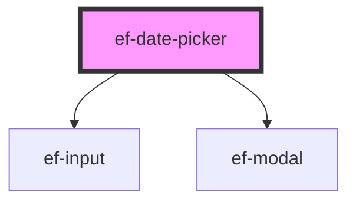

# ef-date-picker

<!-- Auto Generated Below -->

## Properties

| Property      | Attribute      | Description | Type      | Default        |
| ------------- | -------------- | ----------- | --------- | -------------- |
| `appendIcon`  | `append-icon`  |             | `string`  | `undefined`    |
| `disabled`    | `disabled`     |             | `boolean` | `false`        |
| `label`       | `label`        |             | `string`  | `undefined`    |
| `maxDate`     | `max-date`     |             | `string`  | `undefined`    |
| `minDate`     | `min-date`     |             | `string`  | `'1921-01-01'` |
| `prependIcon` | `prepend-icon` |             | `string`  | `undefined`    |
| `showModal`   | `show-modal`   |             | `boolean` | `false`        |
| `textCancel`  | `text-cancel`  |             | `string`  | `'CANCELAR'`   |
| `textConfirm` | `text-confirm` |             | `string`  | `'OK'`         |
| `value`       | `value`        |             | `string`  | `undefined`    |

## Events

| Event          | Description | Type                  |
| -------------- | ----------- | --------------------- |
| `change-value` |             | `CustomEvent<string>` |

## Dependencies

### Depends on

- [ef-input](../ef-input)
- [ef-modal](../ef-modal)

### Graph

----------------------------------------------

*Built with [StencilJS](https://stenciljs.com/)*
