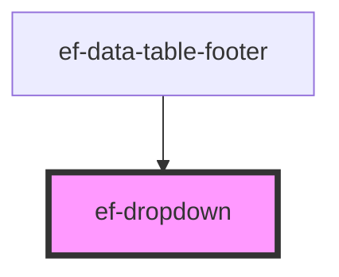

# ef-dropdown

<!-- Auto Generated Below -->

## Properties

| Property       | Attribute        | Description | Type                                        | Default                             |
| -------------- | ---------------- | ----------- | ------------------------------------------- | ----------------------------------- |
| `disabled`     | `disabled`       |             | `boolean`                                   | `false`                             |
| `errorMessage` | `error-message`  |             | `string`                                    | `undefined`                         |
| `items`        | --               |             | `{ id: string \| number; text: string; }[]` | `[]`                                |
| `label`        | `label`          |             | `string`                                    | `undefined`                         |
| `urlIconLeft`  | `url-icon-left`  |             | `string`                                    | `undefined`                         |
| `urlIconRight` | `url-icon-right` |             | `string`                                    | `EVERYFRAMEWORKICONS['ARROW_DOWN']` |
| `value`        | `value`          |             | `string`                                    | `undefined`                         |

## Events

| Event          | Description | Type                  |
| -------------- | ----------- | --------------------- |
| `change-value` |             | `CustomEvent<object>` |

## Dependencies

### Used by

 - [ef-data-table-footer](../ef-data-table-footer)

### Graph

----------------------------------------------

*Built with [StencilJS](https://stenciljs.com/)*
