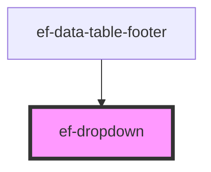

# ef-dropdown

<!-- Auto Generated Below -->

## Properties

| Property       | Attribute        | Description | Type                                        | Default                                                                                                                                 |
| -------------- | ---------------- | ----------- | ------------------------------------------- | --------------------------------------------------------------------------------------------------------------------------------------- |
| `disabled`     | `disabled`       |             | `boolean`                                   | `false`                                                                                                                                 |
| `errorMessage` | `error-message`  |             | `string`                                    | `undefined`                                                                                                                             |
| `items`        | --               |             | `{ id: string \| number; text: string; }[]` | `[     { id: 0, text: 'option1' },     { id: 1, text: 'option2' },     { id: 2, text: 'option3' },     { id: 3, text: 'option4' },   ]` |
| `label`        | `label`          |             | `string`                                    | `undefined`                                                                                                                             |
| `urlIcon`      | `url-icon`       |             | `string`                                    | `undefined`                                                                                                                             |
| `urlIconArrow` | `url-icon-arrow` |             | `string`                                    | `undefined`                                                                                                                             |
| `value`        | `value`          |             | `string`                                    | `undefined`                                                                                                                             |

## Events

| Event         | Description | Type                  |
| ------------- | ----------- | --------------------- |
| `valueChange` |             | `CustomEvent<object>` |

## Dependencies

### Used by

 - [ef-data-table-footer](../ef-data-table-footer)

### Graph

----------------------------------------------

*Built with [StencilJS](https://stenciljs.com/)*
