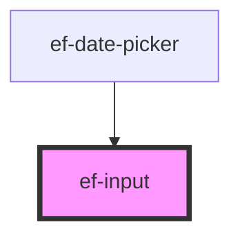

# ef-input

<!-- Auto Generated Below -->

## Properties

| Property       | Attribute       | Description | Type                   | Default     |
| -------------- | --------------- | ----------- | ---------------------- | ----------- |
| `appendIcon`   | `append-icon`   |             | `string`               | `undefined` |
| `disabled`     | `disabled`      |             | `boolean`              | `false`     |
| `errorMessage` | `error-message` |             | `string`               | `undefined` |
| `label`        | `label`         |             | `string`               | `undefined` |
| `prependIcon`  | `prepend-icon`  |             | `string`               | `undefined` |
| `type`         | `type`          |             | `"password" \| "text"` | `'text'`    |
| `value`        | `value`         |             | `string`               | `undefined` |

## Events

| Event   | Description | Type                  |
| ------- | ----------- | --------------------- |
| `event` |             | `CustomEvent<string>` |

## Dependencies

### Used by

 - [ef-date-picker](../ef-date-picker)

### Graph

----------------------------------------------

*Built with [StencilJS](https://stenciljs.com/)*
