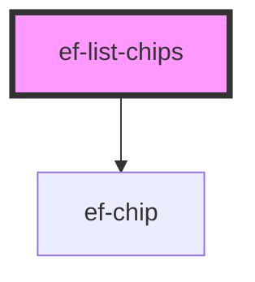

# ef-list-chips

<!-- Auto Generated Below -->

## Properties

| Property    | Attribute | Description | Type                                                              | Default                                                                                                          |
| ----------- | --------- | ----------- | ----------------------------------------------------------------- | ---------------------------------------------------------------------------------------------------------------- |
| `chipGroup` | --        |             | `{ value?: string \| number; text: string; cancel?: boolean; }[]` | `[     { text: 'Creación' },     {       text: 'Creación',       cancel: true,       value: '21342',     },   ]` |

## Dependencies

### Depends on

- [ef-chip](../ef-chip)

### Graph

----------------------------------------------

*Built with [StencilJS](https://stenciljs.com/)*
