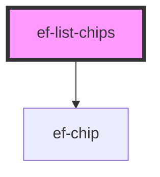

# ef-list-chips

<!-- Auto Generated Below -->

## Properties

| Property       | Attribute       | Description | Type                                                                                | Default                 |
| -------------- | --------------- | ----------- | ----------------------------------------------------------------------------------- | ----------------------- |
| `chipGroup`    | --              |             | `{ value?: string \| number; text: string; cancel?: boolean; urlIcon?: string; }[]` | `[]`                    |
| `visibleChips` | `visible-chips` |             | `number`                                                                            | `this.chipGroup.length` |

## Dependencies

### Depends on

- [ef-chip](../ef-chip)

### Graph

----------------------------------------------

*Built with [StencilJS](https://stenciljs.com/)*
