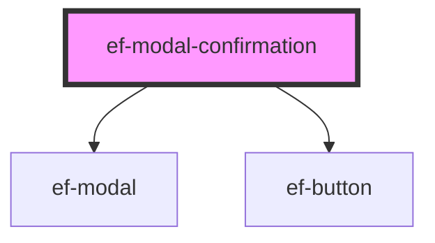

# ef-modal-confirmation

<!-- Auto Generated Below -->

## Properties

| Property           | Attribute           | Description | Type      | Default      |
| ------------------ | ------------------- | ----------- | --------- | ------------ |
| `showModal`        | `show-modal`        |             | `boolean` | `false`      |
| `textCancel`       | `text-cancel`       |             | `string`  | `'Cancelar'` |
| `textConfirmation` | `text-confirmation` |             | `string`  | `'Aceptar'`  |
| `width`            | `width`             |             | `string`  | `undefined`  |

## Events

| Event   | Description | Type               |
| ------- | ----------- | ------------------ |
| `event` |             | `CustomEvent<any>` |

## Dependencies

### Depends on

- [ef-modal](../ef-modal)
- [ef-button](../ef-button)

### Graph

----------------------------------------------

*Built with [StencilJS](https://stenciljs.com/)*
