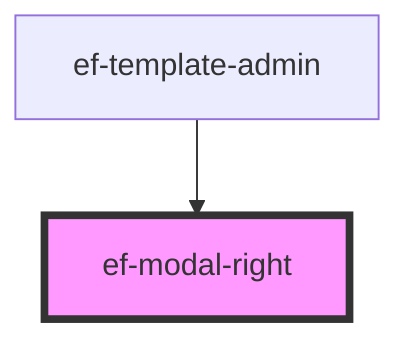

# ef-modal-right

<!-- Auto Generated Below -->

## Properties

| Property    | Attribute    | Description | Type      | Default     |
| ----------- | ------------ | ----------- | --------- | ----------- |
| `showModal` | `show-modal` |             | `boolean` | `false`     |
| `width`     | `width`      |             | `string`  | `undefined` |

## Dependencies

### Used by

 - [ef-template-admin](../ef-template-admin)

### Graph

----------------------------------------------

*Built with [StencilJS](https://stenciljs.com/)*
