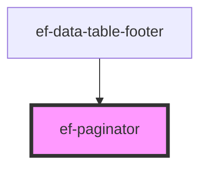

# ef-paginator

<!-- Auto Generated Below -->

## Properties

| Property       | Attribute       | Description | Type     | Default |
| -------------- | --------------- | ----------- | -------- | ------- |
| `pageActive`   | `page-active`   |             | `number` | `1`     |
| `pages`        | `pages`         |             | `number` | `3`     |
| `visiblePages` | `visible-pages` |             | `number` | `3`     |

## Events

| Event   | Description | Type               |
| ------- | ----------- | ------------------ |
| `event` |             | `CustomEvent<any>` |

## Dependencies

### Used by

 - [ef-data-table-footer](../ef-data-table-footer)

### Graph

----------------------------------------------

*Built with [StencilJS](https://stenciljs.com/)*
